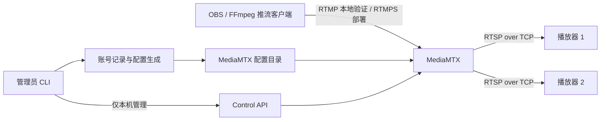

# CialloChat 通用直播推流服务设计与实施规划

2026-10-03 需求修订：观看必须使用每个账号独立的观看密钥；服务端协议转发延迟成为独立验收项。双密钥鉴权、旧数据迁移与撤销已实现，新版验收证据见 docs/validation.md；本地协议层单读者、多读者及慢读者对照结果见 docs/latency.md。播放器侧优化不属于本项目范围。

本文保留项目设计与验收基线。实现入口见 README.md；当前执行证据及实际验证边界见 docs/validation.md，规划中的验收要求不因已有实现而缩减。

项目正式名称为 **CialloChat**。名称规范如下：

- 文档标题、产品介绍和日志中的项目名称统一使用 `CialloChat`。
- 项目目录、仓库名及 Docker Compose 项目名统一使用 `ciallochat`。
- 管理命令沿用 `streamctl`，Python 模块沿用 `streamctl`。


## 1. 目标与交付范围

在本目录制作可部署到 Ubuntu 24.04 的直播推流服务，支持管理员创建多组用户名及相互独立的推流密钥、观看密钥，向不同推流者分配独立直播路径。客户端发布音视频后，服务向多个播放器分发同一路直播。

第一版交付：

- MediaMTX 服务配置与 Docker Compose 部署文件。
- 专用 setup 脚本，安装或复用依赖、初始化目录、检查环境。
- 命令行账号管理：创建、批量导入、列出、禁用、启用、分别重置推流密钥和观看密钥、删除。
- 服务管理：启动、停止、状态、日志、配置应用、备份与恢复。
- 本地 RTMP 输入、带观看认证的 RTSP over TCP 输出及双密钥权限隔离验证。
- 服务端协议转发延迟实测、发送队列与慢读者隔离验证；不将播放器的解码、同步或显示调优列为交付内容。
- RTMPS 部署配置、证书接入与更新流程。
- 中文部署说明、客户端配置说明和本地验证报告。

以小规模多人使用、单机部署为初始规模。第一版不建设网页后台、注册系统、数据库、转码集群、录制系统或计费系统。

## 2. 技术决策与参考项目

采用 MediaMTX 作为媒体服务，Docker Compose 管理运行环境，Python 编写本地管理工具，Bash 编写安装入口。音视频转发不经过 Python 管理程序。

TopazChat 仅作为推流与播放工作流参考，不作为本项目的服务端依赖。其公开仓库说明了客户端许可，但不能据此视为可直接部署的服务端发行物；Streamer 的部分附带二进制另有 LGPL 许可，不能简单把全部组件视为 MIT。第一版无需复制这些客户端组件。参考：[TopazChat 仓库](https://github.com/TopazChat/TopazChat)。

MediaMTX 官方提供容器安装方式，可固定到具体发行版本。实施时选取并验证一个明确版本，同时记录镜像 digest；开发和部署使用同一版本，禁止采用浮动的 latest 或仅主版本标签作为交付锁定值。参考：[MediaMTX 安装说明](https://mediamtx.org/docs/kickoff/install)。

## 3. 系统结构



服务直接转发兼容的音视频编码。第一版验收编码为 H.264 + AAC；不承诺把任意输入编码自动转换成播放器支持的格式。FFmpeg 用于验证时生成测试流和解码，不是生产服务的持续依赖。

每条路径允许一个发布者和多个读者。配置关闭发布者覆盖，第二个发布者连接同一路径时应被拒绝，避免中断现有直播。正式配置仅列出已分配路径，不使用可发布任意路径的兜底规则。

## 4. 账号与授权模型

账号数据包括 username、publish_key_hash、read_key_hash、stream_path、enabled、created_at、updated_at，并有明确的数据格式版本。默认路径为 live/<username>，创建后固定。用户名和路径是公开标识，不能充当观看授权。

默认行为：

- 每个账号有独立随机生成的推流密钥和观看密钥；两者不得相同或互相派生。
- 推流凭据只拥有该路径的 publish 权限，观看凭据只拥有该路径的 read 权限；两者均无管理权限。
- 禁止匿名观看。只有用户名、无密钥、错误密钥、推流密钥用于观看、观看密钥用于推流、跨账号路径读取，都必须拒绝。
- 一个账号的观看密钥可交付给多个观看者；它是共享观看凭据，不提供每位观看者的独立身份或单独撤销。需要撤销持钥者时更换该账号观看密钥。
- 禁用或删除账号后拒绝新的发布与观看连接，并主动终止该路径已有发布者和全部读者。
- 分别支持重置推流密钥和观看密钥。重置推流密钥终止旧发布连接，观看密钥保持不变；因源中断导致播放器需重连属于媒体行为。重置观看密钥终止全部旧观看会话，已有发布者继续推流，推流密钥保持不变。
- 停止直播后，读取端结束或报告无可用流，不生成替代视频。

路径和用户名只允许受限的 ASCII 字符，并拒绝保留名称 any、重复名称、路径穿越、正则表达式和空值。业务记录生成哈希权限配置，为推流与观看生成不同的认证身份，并预留内部身份命名空间。为兼容不会响应 Basic 挑战的 VRChat 播放器，默认观看 URL 使用 `?read_key=...`，服务端在第一次 RTSP 请求中验证密钥；CLI 同时交付 RTSP 普通地址和 RTSPT 房间地址。独立 HTTP 鉴权容器在 Docker 内部网络读取同一生成配置，没有公网端口和独立账号数据库。其只处理连接准入，不接收、转码或缓冲媒体。推流与 API 凭据仍必须按角色和路径验证，没有豁免。旧用户名密码观看地址作为兼容字段保留。

两种密钥默认均使用加密安全随机数生成，至少提供 128 bit 随机熵；支持隐藏输入指定密钥，但拒绝两种密钥相同。分别使用独立随机盐的 Argon2id 哈希，并输出 MediaMTX 所需前缀。明文只在创建或对应重置时交付一次，记录和备份只保存哈希，普通 list/info 不输出密钥；已保存的哈希不能还原遗忘的密钥，遗忘时执行对应重置。

创建时同时交付推流地址与观看地址，观看地址只含观看凭据，不含推流密钥。URL 编码由管理工具完成。参考：[MediaMTX 认证说明](https://mediamtx.org/docs/features/authentication)。

批量导入通过受限权限文件或标准输入接收 username/publish_key/read_key；未指定的密钥独立随机生成，明文交付必须明确指定受限输出位置。全部校验通过才提交，重复项导致整批失败。导入明文文件不纳入项目或备份，不默认替用户删除源文件。

旧数据迁移必须显式、可回滚：原 password_hash 保留为推流密钥哈希，为每个账号新生成观看密钥并受限交付；切换配置时删除匿名 read 授权并终止已有匿名读者。迁移失败或遇到缺少观看密钥的数据时不得回退到匿名观看。备份恢复同样检查格式版本，旧备份先迁移后启用，不允许恢复操作重新开放匿名读取。

## 5. 协议与端口

| 模式 | 推流入口 | 播放出口 | 管理接口 |
| --- | --- | --- | --- |
| local | 127.0.0.1:1935，RTMP | 127.0.0.1:8554，RTSP/TCP | 仅本机映射 |
| production | :1936，RTMPS | :8554，RTSP/TCP | 仅本机映射 |

端口可配置。生产模式关闭明文 RTMP，要求证书和私钥存在且有效，否则启动失败；RTSP 播放必须认证，但仍未加密；观看密钥控制访问，不能防止链路窃听，推流的 TLS 不意味着播放也加密。公网观看应使用经过验证的加密通道；RTSPS 及客户端兼容性作为单独协议扩展评估，不把带密钥的明文 RTSP 描述为加密播放。

RTSP 服务仅启用 TCP，避免额外 RTP/RTCP UDP 端口和容器地址映射问题。第一版关闭 HLS、WebRTC、SRT、MoQ、录制回放、pprof；指标接口默认关闭。Control API 启用时，容器监听与宿主机端口绑定分开配置，宿主机仅绑定回环地址，并使用独立管理认证。

生产端口绑定到明确的服务地址或所有接口，本地模式只绑定回环地址。部署说明列出需要开放的 TCP 端口；setup 不自动重写防火墙。Docker 发布端口的防火墙行为必须按 Docker 的实际规则处理，不能只依据 UFW 显示状态判断暴露范围。参考：[Docker Ubuntu 安装与防火墙说明](https://docs.docker.com/engine/install/ubuntu/)。

客户端说明示例（占位密码）：

```text
OBS 服务：自定义
服务器：rtmps://stream.example.com:1936/live/alice?user=alice&pass=<URL编码后的密码>
串流密钥：留空
播放地址：rtsp://stream.example.com:8554/live/alice?read_key=<URL编码后的观看密钥>
VRChat 地址：rtspt://stream.example.com:8554/live/alice?read_key=<URL编码后的观看密钥>
播放传输：TCP
```

管理工具负责 URL 编码，避免密码中的 &、# 等字符破坏认证参数。凭据展示必须由管理员明确执行，日志不记录含密钥的完整推流或观看 URL。OBS 空串流密钥及 TLS 证书要求以官方说明为依据，并在实施时进行客户端验收：[OBS 推流说明](https://mediamtx.org/docs/publish/obs-studio)。

每路发布连接必须有服务端码率上限，默认 45000 Kbps，旧实例和旧备份缺少字段时也生效。推荐 2560×1440/60 fps H.264 CBR 34000 Kbps、AAC 192 Kbps，保留约 32% 余量。独立 watchdog 每秒检查累计入站字节，约 5 秒平均持续两次超限即断开对应 RTMP/RTMPS/RTSP 发布者；不修改账号密钥、不影响其他发布者、不缓冲媒体。上限通过 `streamctl limits --publish-kbps` 在线修改，不可关闭。规则、异常边界和带宽预算见 [码率配置](docs/bitrate.md)。

## 6. 项目目录规划

```text
.
├── README.md
├── PROJECT_PLAN.md
├── setup.sh
├── streamctl                         # 管理入口
├── compose.yaml
├── compose.local.yaml                # 本地端口与模式覆盖
├── config/
│   ├── settings.example.json         # 非敏感参数示例
│   └── mediamtx.base.yml             # 固定版本的基础模板
├── src/streamctl/
│   ├── cli.py
│   ├── accounts.py
│   ├── config.py
│   ├── service.py
│   └── diagnostics.py
├── requirements.lock
├── scripts/
│   ├── smoke-test.sh
│   └── make-test-cert.sh
├── tests/                            # 必要的账号与配置校验测试
├── docs/
│   ├── deployment.md
│   ├── accounts.md
│   ├── clients.md
│   └── validation.md
└── runtime/                          # 忽略版本控制
    ├── settings.json
    ├── accounts.json                 # 哈希与账号元数据
    ├── mediamtx/mediamtx.yml          # 生成配置
    ├── certs/
    ├── backups/
    └── reports/
```

账号记录是配置生成的唯一数据源，不允许 CLI 和人工编辑生成配置混用。runtime 目录限制访问，私钥与账号文件仅管理员可读写；按容器实际 UID/GID 设置所需读取权限。日志、证书、密码、备份、生成配置和虚拟环境均加入 .gitignore。

## 7. setup 脚本设计

计划接口：

```bash
./setup.sh --mode local --with-validation
sudo ./setup.sh --mode production
```

脚本执行顺序：

1. 检查 /etc/os-release、CPU 架构、权限、网络、目录和端口；识别 WSL、Docker Desktop 与原生服务器。
2. 检查 Docker CLI、daemon 连接和 Compose v2。现有环境可用则复用，不因检测到命令就认定可用。
3. 原生 Ubuntu 缺少 Docker 时，按该系统实际发行代号配置 Docker 官方 apt 仓库并安装 Engine、CLI、containerd 和 Compose 插件。已有冲突包时报告具体冲突，不自动卸载其它工作负载依赖。
4. 安装 ca-certificates、curl、openssl、系统 Python 3 和 venv 支持；使用明确的系统 Python 创建项目 venv，安装锁定的管理工具依赖。避免调用 PATH 中的 Conda Python，也不向系统 Python 直接 pip install。
5. --with-validation 才安装 FFmpeg/ffprobe；图形化 OBS/VLC 不是服务器必装依赖。
6. 创建目录、设置权限、生成初始设置；已有账号、证书和设置保持不变，不创建默认通用密码。
7. 拉取锁定镜像，检查 Compose 配置、证书和端口；输出检查结果与后续命令。
8. 生产模式缺少必要证书时给出明确待配置项并返回非零状态，不降级到明文推流。setup 负责环境准备，服务通过明确的 up 命令启动。

脚本幂等，重复执行不重置用户、不覆盖私钥；提供 --check 只读检查。安装失败给出失败阶段及可重试方式，不删除已有业务状态。Docker 的权限调整不隐式把用户加入 docker 组。

## 8. Ubuntu 24.04 与 26.04 的兼容策略

Ubuntu 24.04 是正式部署验收目标，当前 Ubuntu 26.04 用于开发及简要本地验证。Docker 官方安装文档目前列出两者，但安装仓库必须分别使用 noble 和 resolute，不能混用软件源。

媒体进程运行在同一锁定镜像内，减少宿主机依赖差异。宿主机管理代码限定使用 Python 3.12 及以上共同支持的功能；第三方依赖采用同时兼容目标系统 Python 和当前系统 Python 的锁定版本，优先减少依赖数量。

测试区分三个层次：

- 当前 26.04 环境：本地账号隔离与实际媒体传输验证。
- Ubuntu 24.04 容器：Python 工具、脚本语法和包可用性辅助验证。
- 原生 Ubuntu 24.04 VM 或服务器：setup 安装、Docker daemon、systemd、服务重启和端口绑定的部署验收。

Ubuntu 24.04 普通容器内的成功不能替代原生安装验收；报告中必须注明实际覆盖范围。若仅有当前机器，交付保留 24.04 原生部署待验证项，不宣称已完成。

本次规划检查发现：目录为空；当前系统为 Ubuntu 26.04；docker 命令指向 Windows Docker Desktop 包装入口，但该 WSL 发行版未启用可用集成；未找到 FFmpeg；默认 Python 来自 Conda。Docker Desktop、WSL 集成与宿主权限由用户配置；项目复用已经可用的环境开展媒体验证，不代为修改 Windows 设置。

## 9. 配置更新、账号生效与运维

账号修改采用文件锁避免并发冲突，校验新记录和生成配置，备份旧版本，原子替换文件，再确认服务加载成功。容器挂载配置目录而非单个文件，保证原子替换后容器能读取新文件。

配置采用固定版本的热重载能力，并通过实际发布连接验证生效；不能只以写文件成功作为应用成功。若加载失败，恢复上一配置并报告失败。具体重载行为以实施锁定版本测试为准。

禁用、删除及密钥重置还需要处理已建立连接：通过本机 Control API 定位该路径发布者和读者，按第 4 节的操作范围终止对应连接；若断连操作失败，报告未完全生效并提供明确恢复操作，不只更新文件后宣称权限已撤销。

服务使用 restart: unless-stopped，设置日志轮转；状态命令区分容器运行、接口可用和路径有媒体三个状态。基础镜像可能没有 shell/curl，不能编写依赖镜像内这些工具的健康检查；由宿主机管理工具检查 API，媒体可用性由 smoke test 检查。

备份包括两类密钥哈希、设置、配置和版本元数据，证书私钥仅通过明确的受限备份选项包含。恢复时先验证兼容版本和配置，再应用。升级前备份、显式更新版本和 digest、执行简要验证，失败回到原镜像与原配置。

## 10. TLS 处理

生产模式接入受信任证书及完整证书链，检查证书与私钥匹配、主机名及有效期。项目支持证书路径配置、替换检查和服务重新加载流程；第一版以外部签发和续期的证书为输入，不强制安装反向代理或绑定某个证书供应商。

本地测试脚本可生成带 localhost SAN 的临时测试证书；测试客户端必须显式使用测试 CA 验证连接，不全局关闭证书校验。临时 CA 不自动安装进宿主系统信任库。OBS TLS 手工验证须使用该客户端信任的证书，否则记录为未验证。

证书更新后按锁定版本实际行为执行重载或重启，并验证新证书已生效。若需要重启，文档明确说明活动直播会短暂断开。

## 11. 简要验证与验收标准

自动验证使用隔离的 Compose 项目、临时目录、临时账号及可配置端口，默认只绑定本机。退出时停止测试发布者和读者、删除临时资源，不操作生产账号和容器。

| 验证项 | 方法 | 通过条件 |
| --- | --- | --- |
| 正常推流播放 | FFmpeg 生成测试画面和音频，RTMP 推送，RTSP/TCP 解码 | 在有限超时内同时获得 H.264 视频与 AAC 音频并解码成功 |
| 多路隔离 | Alice/Bob 同时推不同路径 | 两路独立可读，使用不同测试图像以确认未串流 |
| 多读者 | 同一路使用有效观看密钥启动两个读取客户端 | 两者均持续得到媒体 |
| 观看鉴权 | 无凭据、错误观看密钥、仅用户名、推流密钥、其他账号观看凭据分别读取 | 全部认证或授权拒绝；正确观看密钥可解码视频与音频 |
| URL 密钥准入 | 正确观看 URL 的第一次 DESCRIBE 不发送 Authorization | 直接返回 200 和 SDP，无 WWW-Authenticate 挑战；后续可读取音视频 |
| 码率限制 | 高于和低于上限的 RTMP、RTMPS、RTSP 发布者实际发送码流 | 持续超限者自动断开，低于上限者可解码，其他发布者、账号和密钥保持不变 |
| 观看权限隔离 | 观看凭据尝试推流或访问管理 API | 全部拒绝，原发布者不受影响 |
| 观看密钥重置 | 发布期间重置观看密钥 | 已有读者断开、旧密钥拒绝、新密钥可读、发布者保持在线 |
| 旧数据迁移与恢复 | 迁移旧账号、恢复旧备份并模拟迁移失败 | 推流密钥保留，观看密钥受限交付，无匿名 read 权限，失败不开放匿名读取 |
| 匿名或错误密码发布 | 无凭据和错误凭据分别发布 | 认证拒绝且路径未被该客户端建立 |
| 跨路径发布 | Alice 发布 Bob 路径及未知路径 | 均拒绝，已有 Bob 直播持续工作 |
| 重复发布 | 同一账号同时发布同一路径 | 后来的发布者拒绝，原直播保留 |
| 禁用、删除与推流密钥重置 | 修改账号并尝试旧凭据重连 | 按操作范围终止已有连接，旧凭据拒绝，其他类别密钥不被重置 |
| 配置与状态持久化 | 重启服务 | 账号配置保留，可重新推流 |
| RTMPS | 临时 CA、证书校验、实际 TLS 发布与读取 | TLS 校验成功，媒体可读；错误信任/主机名被拒绝 |
| 协议转发延迟 | 预编码 H.264/AAC 输入，匹配 RTMP 发送与 RTSP/TCP 输出的相同压缩视频帧 | 排除编码、解码与显示，提交中位数/P95/最大值、匹配率及负载；单读者、多读者和慢读者对照均须验证 |
| 环境脚本 | 重复运行 setup --check 与初始化 | 不覆盖账号和证书，缺依赖时错误清楚 |

拒绝测试检查服务端拒绝原因和路径状态，不把任意超时或客户端失败都当作认证成功。每次等待设有限超时，最终报告通过、失败或未执行。

自动测试完成后，使用 OBS 发布和 PotPlayer 的 RTSP/TCP 播放做手工检查，确认画面、声音、停止和重连行为；PotPlayer 是用户实际使用的客户端，VLC 可作为对照客户端。没有图形客户端时提供可复现步骤并标注未执行，不因此宣称客户端验证通过。

本地主要媒体样本建议为 720p/30fps、约 2 Mbps、AAC 音频、1 秒关键帧间隔，持续约 30–60 秒。不开展大规模压力测试，不根据短测试承诺公网延迟。

### 11.1 服务端低延迟验收

用户明确要求本项目专注推流工具与服务端转发，不承担播放器调优。播放器秒表结果只作为外部观察，不能直接归因为服务端延迟；OBS/VLC/PotPlayer/FFplay 的持续调参、软件替换和界面测试不再是本项目的延迟验收要求。

1. 保持媒体直接转发，不通过 Python 管理程序，不转码，不引入切片等待、录制队列、按固定时长聚合或额外视频解码。
2. 用预先编码的 H.264/AAC 测试数据，以真实帧率和时间戳发布。计时从压缩帧写入 RTMP 协议前开始，至 RTSP/TCP 接收端收齐对应压缩帧为止；用 RTP 时间戳和 VCL NAL 内容哈希双重匹配，不依据画面显示计时。
3. 明确测量边界：测试包含协议序列化、本地 TCP/Docker 网络、MediaMTX 转发与 RTP 拆包，不包含测试画面的编码、接收后的解码和显示。它是协议转发路径测量，不能声称是精确的 MediaMTX 函数内部耗时。
4. 在 1440p/60 fps、约 6 Mbps 视频加 AAC 音频下采样至少 60 秒，记录实际接收帧率、匹配率、中位数、P95、最大值、丢失/错误帧，检查累积延迟。分别测试单读者、多个正常读者以及正常读者与故意慢读者共存。接收速率不实时或帧内容无法匹配时不能验收通过。
5. 发送队列和写超时按实测结果决定；队列容量不是固定缓冲时间，缩小容量也可能损害关键帧突发传输。不得以“数值更小”代替延迟与完整性的对照测试。队列/超时实验仅作用于隔离容器，确认收益与代价后才修改正式默认值。
6. 将服务器可控的额外等待减到最低，并在报告中给出测得的范围与限制；不承诺零延迟，也不把播放器额外延迟转嫁成推流工具必须解决的指标。

## 12. 实施阶段与依赖顺序

| 阶段 | 工作 | 产物与完成条件 |
| --- | --- | --- |
| 1：基线 | 固定 MediaMTX 版本、核对配置字段及 API、确定 Python 依赖 | 版本锁定记录、目录骨架和基础配置 |
| 2：媒体链路 | Compose 本地模式、RTMP 输入、RTSP/TCP 输出 | 单条测试流可以实际解码 |
| 3：账号工具 | 双密钥数据模型与哈希、独立密钥 CLI、批量导入、旧数据迁移、配置生成 | 推流/观看权限独立，匿名、错误、密钥混用及跨路径拒绝 |
| 4：生效与运维 | 配置应用、按密钥类型撤销连接、状态、日志、备份恢复 | 观看密钥重置不打断发布，禁用/删除撤销发布与观看，恢复不开放匿名读取 |
| 5：部署入口 | setup、系统识别、依赖安装、幂等与诊断 | 24.04 安装流程可复现，26.04 本地环境可用 |
| 6：加密入口 | RTMPS、证书检查、证书替换流程 | 带验证的 TLS 测试通过，生产无明文推流入口 |
| 7：交付验证 | 双密钥隔离 smoke test、必要管理逻辑测试、协议层转发延迟测量、文档 | 先完成服务端延迟验证及必要优化，再验证新增观看鉴权，报告准确区分旧基线与新要求 |

阶段 2 建立可工作的最小链路后扩展账号与安装工具；阶段 5 必须覆盖先前确认的依赖，阶段 7 才作为成品验收。公网服务器实际部署在取得对应环境后执行，不属于当前本地规划完成的证明。

## 13. 预期使用流程

以下命令已实现；账号创建同时交付两类密钥和对应 URL：

```bash
./setup.sh --mode local --with-validation
./streamctl user add alice
./streamctl user add bob
./streamctl up --mode local
./streamctl status
./scripts/smoke-test.sh
```

Ubuntu 24.04 部署流程：安装环境 → 配置服务主机名和证书 → 创建账号 → 校验生成配置 → 启动 production 模式 → 从独立客户端验证推流与读取 → 按文档维护账号和证书。

CLI 包括 user add/list/import/disable/enable/reset-password/reset-read-key/delete；reset-password 保留为仅重置推流密钥的兼容命令，reset-read-key 仅重置观看密钥。服务命令包括 up/down/status/logs/config-check/apply/backup/restore/doctor。涉及密码的操作使用隐藏输入或标准输入；批量凭据交付只写到管理员明确指定且权限受限的位置。

## 14. 容量边界与后续扩展

出口带宽粗略按各路直播码率乘该路读者数再求和，并预留协议开销。例如一条 6 Mbps 直播同时有 20 个读者，媒体出口约 120 Mbps，实际需要更高可用带宽。无转码并不表示不存在网络、连接数和内存限制。

本版提供每路平均码率超限自动断连，默认 45 Mbps；它不是逐包带宽整形、全服务器总出网限速或观众数限制。不提供流量额度或高可用保证。约 34.2 Mbps 的 2K 直播，每名观众约占同等出网带宽，200 Mbps 出网下四人约 137 Mbps、五人约 171 Mbps，另需预留协议开销。

本版 HTTP 鉴权回调用于 URL 观看密钥兼容，账号仍由文件和 CLI 管理。网页管理、账号到期、复杂授权或跨节点需求出现时再评估数据库，不因人数达到固定值更换架构。可按需要追加 HLS、RTSPS、指标采集或录制，每项独立验收。
